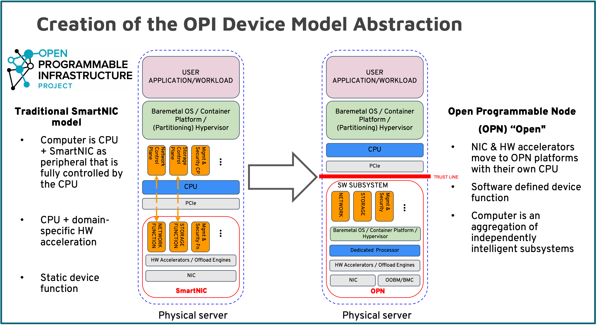
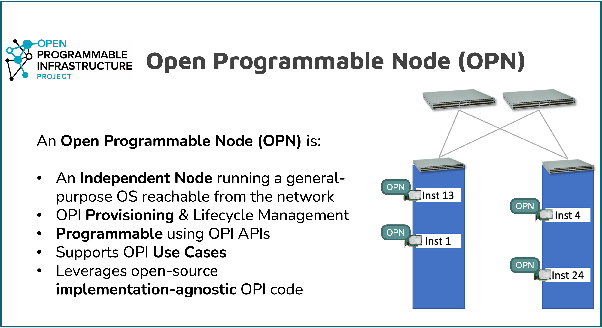

# **OPI Terminology**

An Open Programmable Node (OPN) is:

* An independent system (node) reachable from the network running a general purpose OS
* Provisioned using the mechanisms defined by the OPI Provisioning & Lifecycle Workgroup
* Programmable using the APIs defined by the OPI APIs Workgroup
* Capable of running one or more use cases defined by the OPI Use Cases Workgroup
* Developed leveraging open-source implementation agnostic code developed by the OPI Developer Platform Workgroup

The first examples of OPN platforms will be DPUs & IPUs that plug into a Server PCIe slot.
Future form factors such as Smart Switches can also act as OPN platforms.
OPN platforms connect to orchestration, SDN controllers, and/or mangement applications over the network.

# Alternative

* OPI uses the term **DPU/IPU** to represent the entire class of DPU/IPU-like devices, and can refer to either the system containing a DPU/IPU-like device or to the device itself. In cases where brevity is needed in the codebase, OPI developers can use the term **xPU**.
